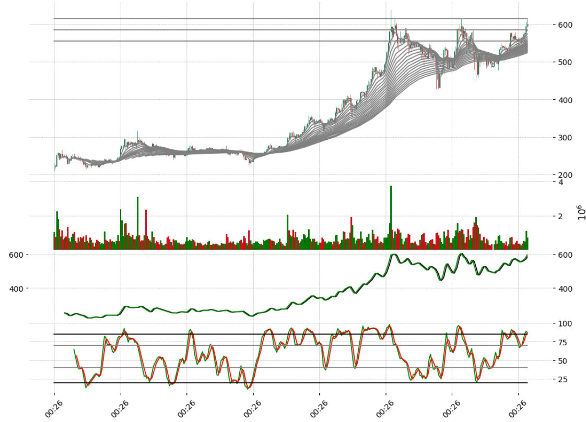
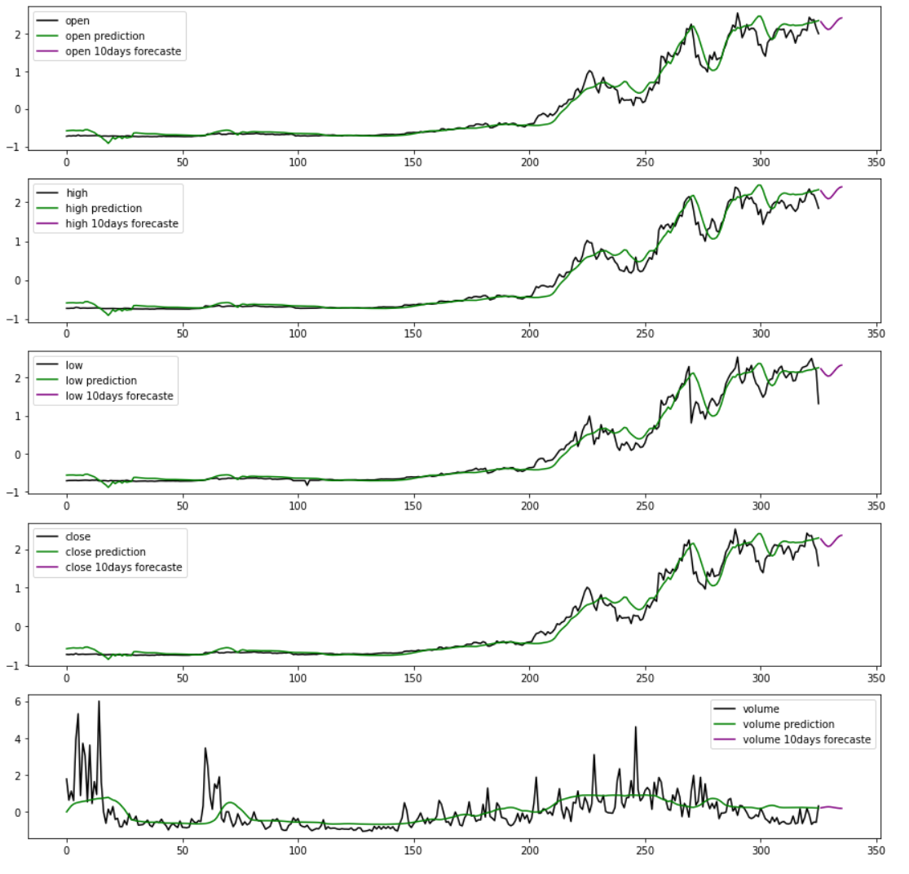

# Crypto-Trade Forecasting System

The Crypto-Trade Forecasting System is an innovative and user-friendly web application designed to assist traders in forecasting future prices of cryptocurrencies. By leveraging real-time stock prices and data from Python's Binance API, the system provides real-time visualization and uses state-of-the-art models to predict future stock prices. This application is built using powerful machine learning technologies such as scikit-learn, Keras, and TensorFlow, and is implemented in Python.

## Features

* **Real-Time Data**: Utilizes real-time stock prices and data from Python's Binance API for up-to-date analysis.
* **State-of-the-Art Model**: Uses advanced Keras models for accurate forecasting of future cryptocurrency prices.
* **User-Friendly Interface**: A clean and intuitive interface for easy data visualization and interaction.
* **Real-Time Visualization**: Provides immediate and dynamic visualization of stock prices and forecast results.
* **Trader-Friendly Solution**: Designed to help traders make informed decisions based on accurate and timely forecasts.

## Technologies Used

* **scikit-learn**: For data preprocessing and feature extraction.
* **Keras/TensorFlow**: Model building for price forecasting.
* **Python**: Core logic and implementation of the application.
* **Binance API**: For real-time cryptocurrency data retrieval.

## How It Works

### Model Deployment
1. **Model Training**: The Keras model is trained using historical cryptocurrency data.
2. **Data Processing**: The service processes the real-time data and performs inference using the trained model.
3. **Result Communication**: The service returns the forecast results to the user interface for display.

## Model Performance

The performance of the model is evaluated using various metrics to ensure its accuracy and reliability. The table below presents the performance metrics:

| Metric              | Value   |
|---------------------|---------|
| Mean Squared Error  | 0.16  |
| Mean Absolute Error | 0.43   |

## Setup

### Model Training and Deployment

1. **Clone the Repository**:
    ```bash
    git clone https://github.com/hungrycarpet/Machine-Learning-Deep-Learning-Projects.git
    ```

2. **Navigate to the Project Directory**:
    ```bash
    cd Crypto-Trade-Forecasting
    ```

3. **Set up the Environment**:
    ```bash
    pip install -r requirements.txt
    ```

4. **Train the Model**:
    Run the training script to train the Keras model on historical cryptocurrency data.


## Screenshots

### Stock Prices Visualization


### Stock Prices Forecasting


## Contact

For any queries or feedback, please contact me at ***manasparasar@gmail.com***

## License

MIT License
